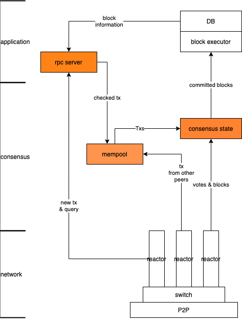

# CHAINBFT

## architecture



系统架构分为三层，从下到上依次是：网络层、共识层、应用层
- 网络层：使用tendermint/p2p，reactor模式，为上层业务提供点对点的连接服务，维持长时间的TCP连接；应用可以选择点对点发送消息，或者向目前所有的节点广播消息
- 共识层：共识核心模块
- 应用层：负责实现交易的执行逻辑

## consensus

共识模块由以下几个组件组成：
- ConsensusState - 共识状态机，负责共识逻辑的推进，main goroutine
    - RoundState - 共识机内部的状态节点、该轮slot的区块、投票是否也保存在这里，因为是和该轮状态相关的东西
    - SlotClock - 复用consensus的reactor，负责和其他节点同步slot的时间长度，同时向共识模块提供slot超时事件来触发slot切换
- State - 区块链的状态，维护除了error状态外的所有区块
    - BlockTree：所有区块根据blockHash形成的树，根据树得到下一个提案应该follow的父区块、或者验证一个收到的提案是否符合规定的提案规则
    - BlockSet：维护所有未提交的区块：suspectBlock&precommitBlock
- BlockExcutor - 从mempool获取所有和precommitBlock不冲突的交易来生成新的区块；提交区块，执行区块的交易
- Store - 数据持久化，未实现
- Mempool - 交易缓存池

### 共识状态机的转移

状态机有4个状态：RoundStepSlot、RoundStepApply、RoundStepPropose、RoundStepWait
```plain

          +-----------------+                              +---------------+
    +---- |  RoundStepSlot  + <--------------------------- + RoundStepWait |
    |     +-----------------+                              +---------------+ 
    |                                                               |
    V                                                               |
+-----------------+                                        +------------------+
| RoundStepApply  |  ------------------------------------> + RoundStepPropose |
+-----------------+                                        +------------------+

RoundStepSlot - 切换到新slot的事件，目前只有SlotClock的timeout事件可以触发
RoundStepApply - 成功切换到新的slot后，在该阶段执行上一轮slot的提案，更新state
RoundStepPropose - 根据slot和节点自己的编号，决定节点是否是这轮slot的提案者，如果不是跳过，否则生成新的提案并广播
RoundStepWait - 等待slotClock的超时事件发生，在此期间收集提案和其他节点的投票
```

### 模块之间的调用关系

